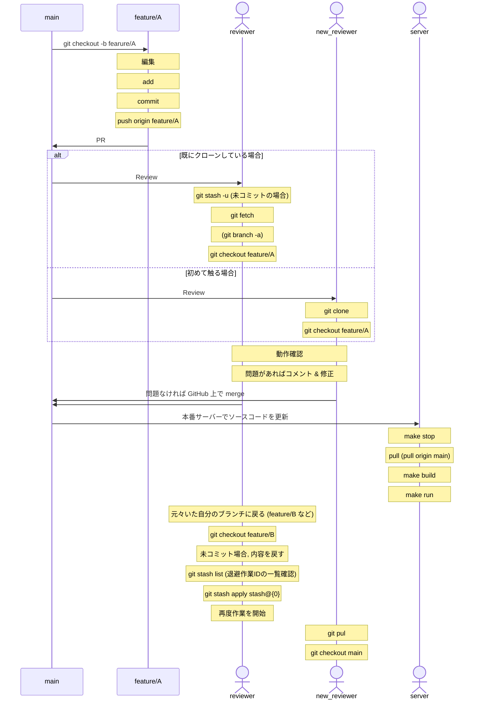

# github コマンド
# リモートリポジトリ関連

## リモートリポジトリの確認

```bash
git remote -v
```

## リモートリポジトリの追加

```bash
git remote add [name] [URL]
```

## リモートリポジトリの削除

```bash
git remote rm [name]
```

## リモートリポジトリの URL の変更

```bash
git remote set-url origin [URL]
```

## リモートリポジトリの名前を変更 name1 → name2

```bash
git remote rename [name1] [name2]
```

## デフォルトのリモートを確認する方法

```bash
git branch -vv
```

すべてのローカルブランチについて一括で確認したい場合は `--all` オプションを使用すれば可能です．

```bash
git branch -vv --all

# git branch -vv -a でも可能 
```

## デフォルトのリモートを変更する方法

```bash
git push -u origin main
```

`-u` をつけて実行すると該当ブランチのデフォルトリモートが変更されます．

あるいは以下の方法でも可能です．

```bash
git branch -u github main
```

# sub module 関連

## sub module の pull 初回

```bash
git submodule update --init --recursive
```

## sub module の pull 2 回目

```bash
git pull --recurse-submodules
```

# git ignore のキャッシュを削除する方法

## ファイル全体を削除する場合

```bash
git rm -r --cached . 
```

## ファイルを指定して削除する場合

```bash
git rm -r --cached [ファイル名]
```

# 編集内容を取り消す方法 (add する前)

```bash
git checkout [ファイル名]
```

# チーム開発フロー

