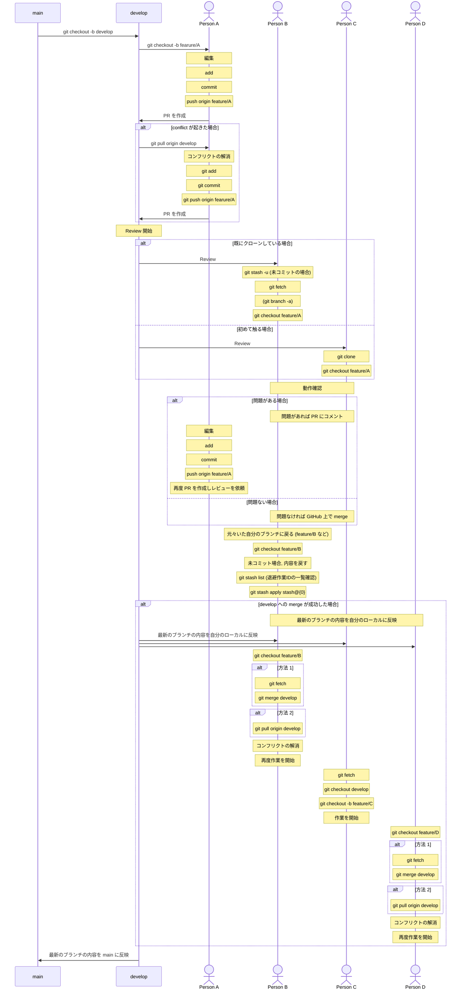

```mermaid
sequenceDiagram
    participant main
    participant develop
    actor Person A
    actor Person B
    actor Person C
    actor Person D

    main ->> develop : git checkout -b develop
    develop ->> Person A : git checkout -b fearure/A

    Note over Person A : 編集
    Note over Person A : add
    Note over Person A : commit
    Note over Person A : push origin feature/A
    Person A ->> develop : PR を作成

    alt conflict が起きた場合
    develop ->> Person A : git pull origin develop
    Note over Person A : コンフリクトの解消
    Note over Person A : git add
    Note over Person A : git commit
    Note over Person A : git push origin fearure/A
    Person A ->> develop : PR を作成
    end

    Note over develop : Review 開始

    alt 既にクローンしている場合
    develop ->> Person B : Review
    Note over Person B : git stash -u (未コミットの場合)
    Note over Person B : git fetch
    Note over Person B : (git branch -a)
    Note over Person B : git checkout feature/A
    else 初めて触る場合
    develop ->> Person C : Review
    Note over Person C : git clone
    Note over Person C : git checkout feature/A
    end

    Note over Person B, Person C : 動作確認

    alt 問題がある場合
        Note over Person B, Person C : 問題があれば PR にコメント
        Note over Person A : 編集
        Note over Person A : add
        Note over Person A : commit
        Note over Person A : push origin feature/A
        Note over Person A : 再度 PR を作成しレビューを依頼
    else 問題ない場合
        Note over Person B, Person C : 問題なければ GitHub 上で merge
    end

    Note over Person B : 元々いた自分のブランチに戻る (feature/B など)
    Note over Person B : git checkout feature/B
    Note over Person B : 未コミット場合, 内容を戻す
    Note over Person B : git stash list (退避作業IDの一覧確認)
    Note over Person B : git stash apply stash@{0}  


    alt develop への merge が成功した場合

        Note over Person B, Person D : 最新のブランチの内容を自分のローカルに反映
        develop ->> Person B : 最新のブランチの内容を自分のローカルに反映
        develop ->> Person C : 
        develop ->> Person D : 

        Note over Person B : git checkout feature/B
        alt 方法 1
            Note over Person B : git fetch
            Note over Person B : git merge develop
        end
        alt 方法 2
            Note over Person B : git pull origin develop
        end
        Note over Person B : コンフリクトの解消
        Note over Person B : 再度作業を開始

        Note over Person C : git fetch
        Note over Person C : git checkout develop
        Note over Person C : git checkout -b feature/C
        Note over Person C : 作業を開始

        Note over Person D : git checkout feature/D
        alt 方法 1
            Note over Person D : git fetch
            Note over Person D : git merge develop
        end
        alt 方法 2
            Note over Person D : git pull origin develop
        end
        Note over Person D : コンフリクトの解消
        Note over Person D : 再度作業を開始
    end

    develop ->> main : 最新のブランチの内容を main に反映

```